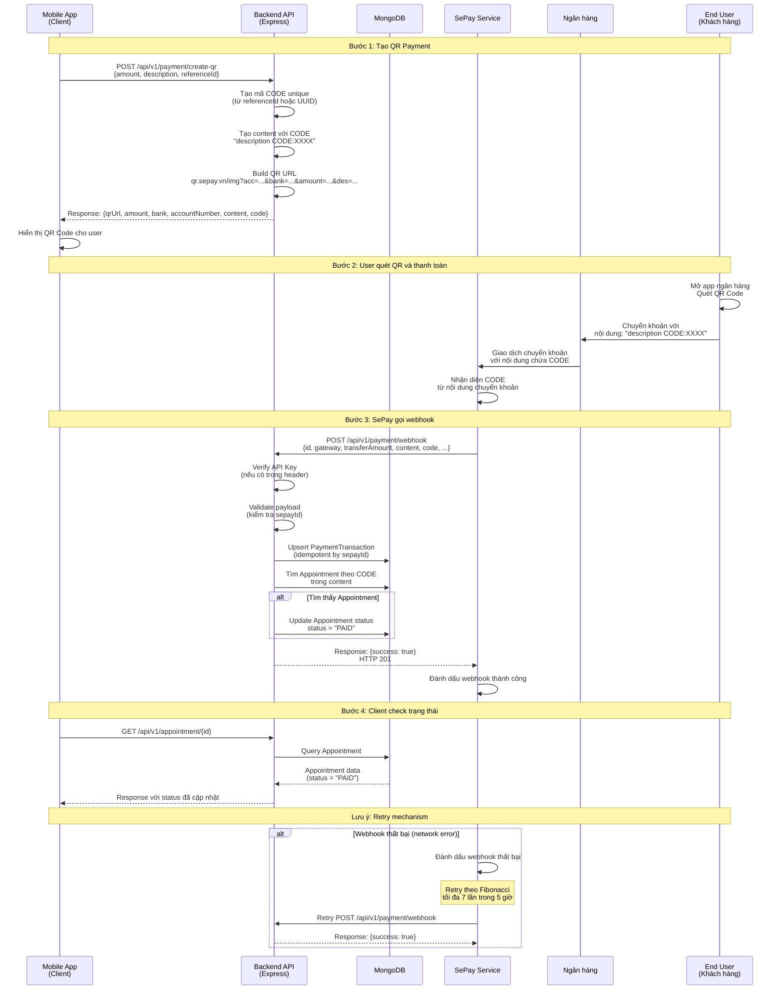
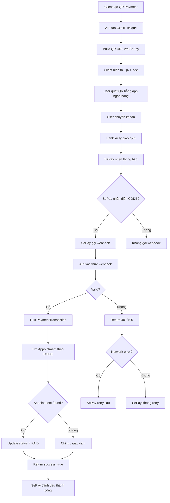

# Payment Sequence Diagram - SePay Integration

## Quy trình thanh toán qua SePay



## Chi tiết các bước

### 1. Tạo QR Payment (Client → API)
- **Request:**
  ```json
  POST /api/v1/payment/create-qr
  {
    "amount": 2277000,
    "description": "Thanh toan don #1234",
    "referenceId": "ORDER_1234"
  }
  ```
- **Response:**
  ```json
  {
    "success": true,
    "data": {
      "qrUrl": "https://qr.sepay.vn/img?acc=...&bank=...&amount=...&des=...",
      "code": "ABCD123456"
    }
  }
  ```

### 2. User thanh toán (User → Bank → SePay)
- User quét QR bằng app ngân hàng
- App tự điền thông tin: số tài khoản, số tiền, nội dung
- User xác nhận chuyển khoản
- Bank xử lý giao dịch
- SePay nhận thông báo từ ngân hàng

### 3. Webhook từ SePay (SePay → API)
- **Request từ SePay:**
  ```json
  POST /api/v1/payment/webhook
  Header: Authorization: Apikey <SEPAY_API_KEY>
  {
    "id": 92704,
    "gateway": "Vietcombank",
    "transferAmount": 2277000,
    "content": "Thanh toan don #1234 CODE:ABCD123456",
    "code": "ABCD123456",
    "transferType": "in",
    ...
  }
  ```
- **Response:**
  ```json
  {
    "success": true,
    "id": 92704
  }
  ```
- **HTTP Status:** 201 (hoặc 200)

### 4. Xử lý trong Backend
1. Lưu giao dịch vào `PaymentTransaction` (idempotent)
2. Tìm CODE trong `content` field
3. Match CODE với `Appointment` (nếu có)
4. Cập nhật `Appointment.status = "PAID"`

## Flowchart: Payment Flow



## Database Schema liên quan

### PaymentTransaction
- `sepayId` (unique) - ID từ SePay
- `code` - Mã CODE trong content
- `transferAmount` - Số tiền
- `content` - Nội dung chuyển khoản
- `relatedAppointmentId` - Link đến Appointment (nếu có)

### Appointment
- `status` - PENDING → PAID (sau khi nhận webhook)
- `customerEmail` - Email khách hàng
- `serviceTypeIds` - Danh sách dịch vụ

## Error Handling

### 1. Webhook thất bại
- SePay retry tự động (theo Fibonacci, max 7 lần)
- Backend phải idempotent (không duplicate khi retry)

### 2. CODE không tìm thấy
- Vẫn lưu giao dịch vào `PaymentTransaction`
- Không update `Appointment` nếu không match CODE

### 3. Duplicate payment
- Kiểm tra `sepayId` unique trong database
- Upsert thay vì insert để tránh duplicate

## Security

1. **API Key Authentication** - SePay gửi header `Authorization: Apikey <KEY>`
2. **Idempotency** - Dùng `sepayId` để đảm bảo không xử lý trùng
3. **Validation** - Validate payload từ SePay trước khi xử lý

